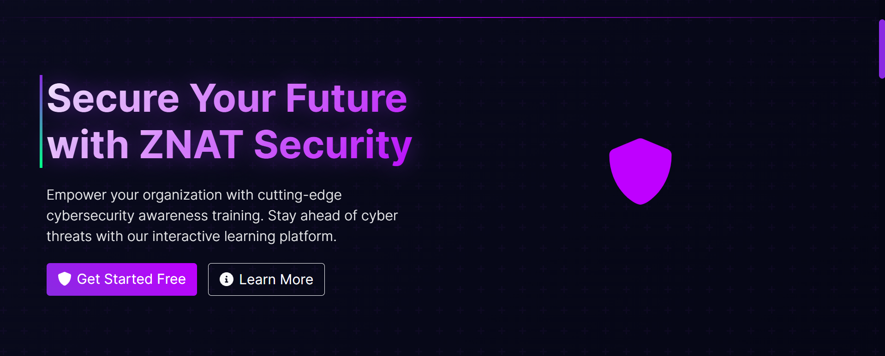

# ZNAT - Cybersecurity Awareness Training Platform



## About ZNAT

ZNAT is a comprehensive cybersecurity awareness training platform built with Django, designed to help organizations train their employees in cybersecurity best practices through interactive courses and assessments. In today's digital landscape, human error remains one of the biggest security vulnerabilities in organizations. ZNAT addresses this challenge by providing an engaging, interactive learning environment where employees can develop crucial cybersecurity skills.

## Demo & Planning

- **Planning Materials**: 
Trello board for project management and task tracking.
   - [Trello Board](https://trello.com/b/680d331d/znat-phishing-awareness-platform-lms)
 


## Technology Stack

### Backend
- Python 3.11
- Django 4.2

### Database
- PostgreSQL

### Frontend
- HTML5, CSS3, JavaScript
- Bootstrap 5
- Font Awesome icons
- AJAX for dynamic content

### Security
- Django's built-in security features
- bcrypt for password hashing
- django-cleanup for secure file handling
- django-cors-headers

## Attributions

- Bootstrap 5 - [MIT License](https://github.com/twbs/bootstrap/blob/main/LICENSE)
- Font Awesome Icons - [Font Awesome Free License](https://fontawesome.com/license/free)
- Django - [BSD License](https://github.com/django/django/blob/main/LICENSE)
- Cybersecurity Icons by [Flaticon](https://www.flaticon.com/authors/flat-icons)
- Icons made by [Freepik](https://www.freepik.com) from [www.flaticon.com](https://www.flaticon.com/)
- ChatGPT - [OpenAI](https://openai.com/)


## Getting Started

1. Clone the repository:
```bash
git clone https://github.com/yourusername/znat.git
cd znat
```

2. Create and activate virtual environment:
```bash
python -m venv venv
source venv/bin/activate  # On Linux/Mac
```

3. Install dependencies:
```bash
pip install -r requirements.txt
```

4. Set up environment variables:
```bash
cp .env.example .env
# Update .env with your configuration
```

5. Run migrations:
```bash
python manage.py migrate
```

6. Create superuser:
```bash
python manage.py createsuperuser
```

7. Run the development server:
```bash
python manage.py runserver
```


## Future Enhancements

  - Phishing email simulation campaigns
  - Social engineering attack scenarios
  - Achievement badges
  - Employee leaderboards
  - Monthly security champions

